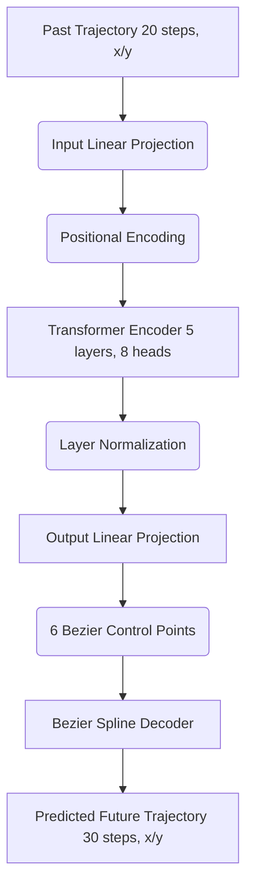

# Spline-Transformer Motion Predictor

This repository contains a Transformer-based motion prediction model trained on the Argoverse 2 dataset. It predicts the future trajectory of vehicles based on their past trajectory.

## Architecture

The core of the network uses a standard PyTorch Transformer with Pre-Layer Normalization for stable training. Instead of predicting raw coordinates for each future timestep, the Transformer outputs the control points of a Bezier Spline. A differentiable Bezier Spline Decoder then uses these control points to render the final smooth trajectory.



## Setup and Usage

Install the required dependencies using pip:
```bash
pip install -r requirements.txt
```

You can run training locally using the scripts in `src/`. For a quick start and demonstration, check out the provided Jupyter Notebook.

## Try it in Colab

A quickstart notebook is included to test the code seamlessly in Google Colab.
[Open try_in_colab.ipynb](try_in_colab.ipynb)

## Evaluation Plots

The evaluation scripts use Plotly to visualize the ground truth vs the predicted trajectories.


