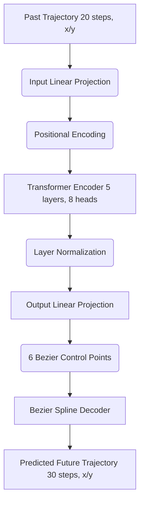
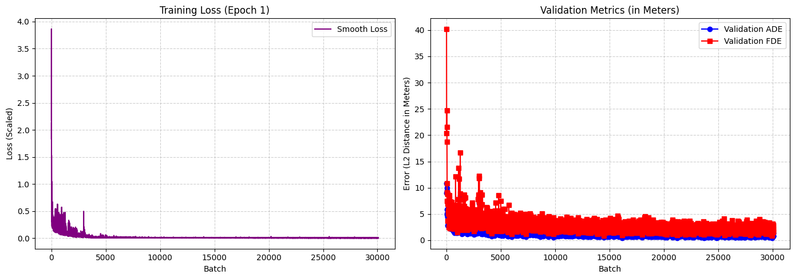

# Spline-Transformer Motion Predictor

**TLDR:** This repository implements a Transformer-based motion prediction model that forecasts future vehicle trajectories from the Argoverse 2 dataset. Instead of predicting raw discrete waypoints, it predicts the control points of a Bezier Spline for smooth, kinematic-friendly trajectories.

[](https://colab.research.google.com/github/haggler3/AV2_Motion_Transformer/blob/main/try_in_colab.ipynb)

**Model Weights:** [haggler3/spline-transformer-av2 on Hugging Face](https://huggingface.co/haggler3/spline-transformer-av2)

---

## Architecture

The network uses a standard PyTorch Transformer with Pre-Layer Normalization for stable training. Instead of predicting raw coordinates for each future timestep, the Transformer outputs the control points of a Bezier Spline. A differentiable Bezier Spline Decoder then uses these control points to render the final smooth trajectory.



## Setup & Usage

### 1. Installation
Clone the repository and install the dependencies:
```bash
git clone git@github.com:haggler3/AV2_Motion_Transformer.git
cd AV2_Motion_Transformer
pip install -r requirements.txt
```

### 2. Download Data
Use the provided script to download the Argoverse 2 dataset splits:
```python
from src.data import download_av2_split
download_av2_split("val", 50, "./data")
```

### 3. Training
Train the model by pointing it to the downloaded data directory:
```python
from src.train import train
model = train("./data", epochs=5, scale_factor=50.0)
```

### 4. Evaluation & Visualization
Visualize the top predictions on a dark-mode styled plot:
```python
import torch
from src.data import load_polars_dataframe, ArgoverseVehicleDataset
from src.evaluate import visualize_good_predictions

device = torch.device('cuda' if torch.cuda.is_available() else 'cpu')
df = load_polars_dataframe("./data")
dataset = ArgoverseVehicleDataset(df)

visualize_good_predictions(model, dataset, device, num_plots=5)
```

---

## Training Performance

Here is the training loss and validation metrics (ADE / FDE in meters) from the original notebook training run:



---

## Citations
If you use this work, please cite the Argoverse 2 dataset:
```bibtex
@inproceedings{Argoverse2,
  title={Argoverse 2: Next Generation Datasets for Autonomous Driving Perception and Forecasting},
  author={Benjamin Wilson and William Qi and Tanmay Agarwal and John Lambert and Jagjeet Singh and Siddhesh Khandelwal and Bowen Pan and Ratnesh Kumar and Andrew Hartnett and Jhony Kaesemodel Pontes and Deva Ramanan and Peter Carr and James Hays},
  booktitle={Proceedings of the Neural Information Processing Systems Track on Datasets and Benchmarks (NeurIPS Datasets and Benchmarks 2021)},
  year={2021}
}
```
